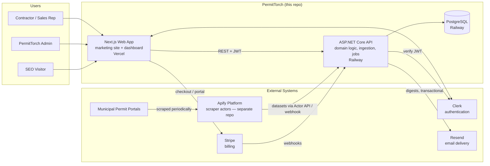
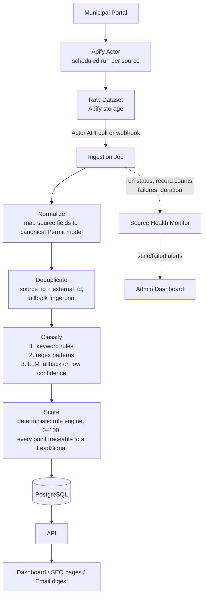
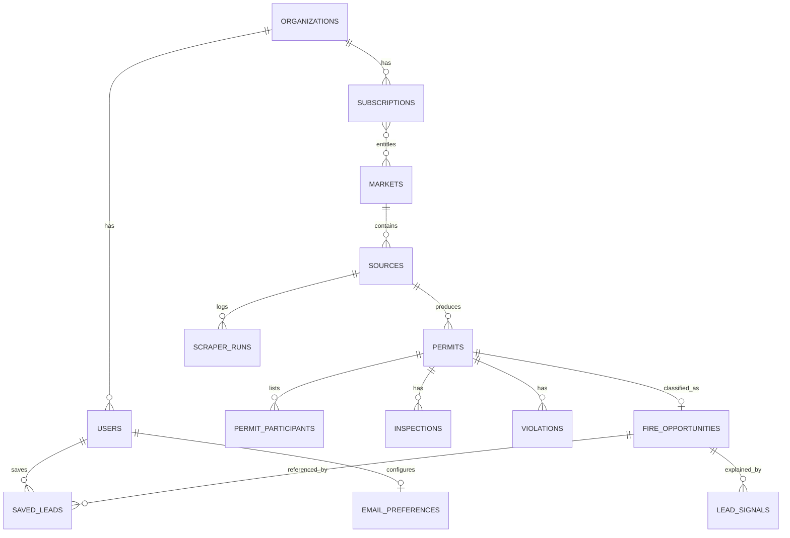
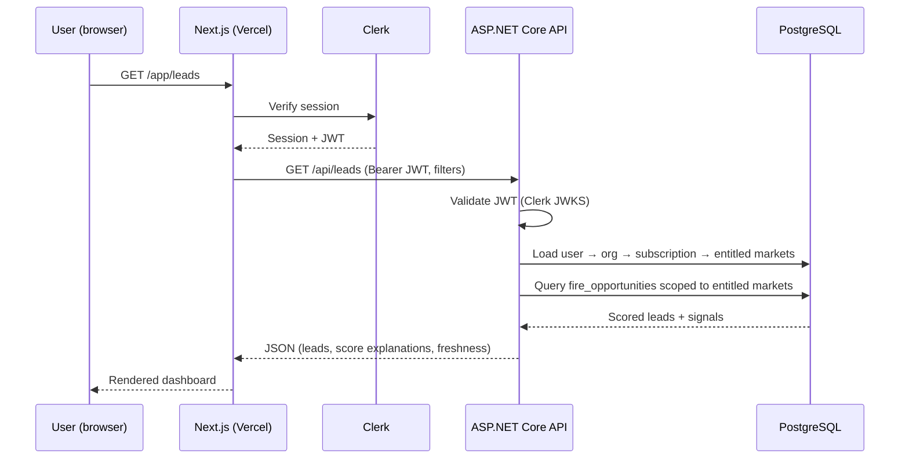

# PermitTorch — Architecture

**Version:** 1.0
**Status:** Approved for MVP
**Source of truth for requirements:** [Prd.md](Prd.md)

This document describes the technical architecture for the PermitTorch MVP: a lead-intelligence SaaS that converts public permit data into scored, explainable sales opportunities for fire-protection contractors.

---

## 1. Architecture Decisions (Summary)

| Decision | Choice | Rationale |
| --- | --- | --- |
| Overall shape | **Modular monolith** — one web app, one API | No microservices during MVP (PRD §32, §76) |
| Frontend | Next.js + TypeScript, Tailwind + shadcn/ui | SSR/SSG for SEO, fast SaaS UI development |
| Backend | ASP.NET Core Web API (C#) | Long-term home for the data pipeline and domain logic |
| Database | PostgreSQL (single instance) | Handles OLTP + search + aggregates for MVP; no Redis/Elasticsearch initially |
| Data collection | Apify actors (separate repo) | Existing scraper; isolated behind a provider abstraction |
| Auth | Clerk | Not a competitive advantage — buy, don't build |
| Billing | Stripe Billing | Subscriptions, trials, customer portal, webhooks |
| Email | Resend | Digest + transactional email |
| Observability | Sentry (errors) + PostHog (product analytics) | Minimum viable observability |
| Hosting | Vercel (web) + Railway (API + Postgres) | Low DevOps overhead; no AWS during validation |
| Repo layout | Monorepo (`apps/web`, `apps/api`) | Shared types/config in one place; scraper stays in its own repo |

---

## 2. System Context



**Key boundary:** the Apify scraper is a separate project. PermitTorch consumes its output through the `IPermitSourceProvider` abstraction (§6) and never lets Apify-specific structures leak past the ingestion layer.

---

## 3. Data Pipeline

The pipeline is the product. Users never trigger scraping directly — data flows on a schedule, and the dashboard only ever reads from PostgreSQL.



Pipeline rules (from PRD §15, §38, §46, §62):

- **Scoring is deterministic.** No LLM in the primary scoring path. Weights live in configuration, not code, so they can be tuned without deploys.
- **Every score is explainable.** Each contributing signal is persisted as a `LeadSignal` row; the UI renders the exact breakdown.
- **LLM is a classification fallback only**, invoked when keyword/regex confidence is low, and its output is stored (never computed at request time).
- **Deduplication is mandatory** before anything reaches users. Primary key: `source_id + external_id`. Fallback fingerprint: `address + permit_type + filed_date + description`.
- **Source records are preserved historically** — updates never blindly overwrite prior data.

---

## 4. Application Components

### 4.1 Next.js Web App (`apps/web`)

Two surfaces in one app:

| Surface | Routes | Rendering |
| --- | --- | --- |
| Marketing + SEO | `/`, `/pricing`, `/how-it-works`, `/fire-protection-leads`, `/locations/[state]/[city]`, `/blog` | SSR/SSG — server-rendered with unique metadata, sitemap, structured data |
| Authenticated app | `/app/leads`, `/app/leads/[id]`, `/app/saved`, `/app/alerts`, `/app/account` | Server components + client interactivity |
| Admin | `/app/admin/sources`, `/app/admin/runs`, `/app/admin/users`, `/app/admin/subscriptions` | Role-gated (server-side check, never UI-only) |

The web app holds **no domain logic**. It authenticates via Clerk, calls the API with the session JWT, and renders. SEO city pages fetch pre-computed aggregates from the API — they only exist for markets with real data (PRD §24).

### 4.2 ASP.NET Core API (`apps/api`)

Vertical-slice feature organization (PRD §78):

```text
PermitTorch.Api/
  Features/
    Leads/            # retrieval, filtering, detail, CSV export
    Markets/          # market catalog, aggregates for SEO pages
    SavedLeads/       # save, contacted status
    Subscriptions/    # Stripe webhooks, entitlement checks
    Organizations/    # org + user membership
    EmailDigests/     # digest generation and preferences
    Admin/            # source health, scraper runs, manual overrides
  Domain/             # Permit, FireOpportunity, LeadSignal, scoring engine
  Infrastructure/     # IPermitSourceProvider, ApifyPermitProvider, Clerk JWT validation, Resend client
  Jobs/               # ingestion, health checks, digest sender, stale-record expiry
  Data/               # EF Core DbContext, migrations
```

Responsibilities: lead retrieval and filtering, scoring, saved leads, market entitlements, subscription authorization, permit ingestion, normalization, deduplication, admin operations.

**Background jobs** run in-process via `IHostedService` initially (Hangfire later if needed — PRD §43): ingestion polling, source health checks, email digest generation, stale-record expiry, SEO aggregate refresh.

### 4.3 PostgreSQL

Single database, EF Core migrations. Core tables (PRD §33):



Search uses Postgres indexes, `ILIKE`, and full-text search when needed. No Elasticsearch, no vector DB, no Redis until performance demands it (PRD §44–45).

---

## 5. Request & Authorization Flow



**Authorization is always server-side.** Market entitlement is enforced in the API query layer (leads outside the subscription's markets are never returned), never by hiding UI elements (PRD §58).

---

## 6. The `IPermitSourceProvider` Abstraction

To prevent Apify vendor lock-in (PRD §40), all data collection sits behind one interface:

```text
IPermitSourceProvider
  ├── ApifyPermitProvider        (MVP — wraps Actor API / webhooks)
  └── future: DirectArcGISProvider, SocrataProvider, CKANProvider, AccelaProvider
```

The ingestion job asks a provider for new raw records for a source; everything downstream (normalize → dedupe → classify → score) is provider-agnostic. Raw Apify run IDs and dataset structures never appear outside `Infrastructure/`.

### 6.1 Scraper Output Contract (as implemented)

The scraper repo already guarantees its output shape — `ApifyPermitProvider` consumes three things per run:

| Artifact | Where | Contents |
| --- | --- | --- |
| **Dataset records** | Apify dataset | Zod-validated against `PermitLeadSchema` before push (guaranteed shape, not best-effort). Most fields are `string \| null` — never absent. Dates are ISO strings. Sorted by `leadScore` desc, capped at **5,000 records per run**. Full field table + example: scraper README §4–5. |
| **Run status & stats** | Apify Run object (Actor API) | `status`, `startedAt`, `finishedAt`, `stats.itemCount` — read from the Apify API; the scraper does not emit these itself. |
| **`COVERAGE_REPORT`** | Run's key-value store | `requestedJurisdictions`, `supportedJurisdictions`, `successfulJurisdictions`, `failedJurisdictions`, `unsupportedJurisdictions`, `recordsFound`, `unsupportedDetails[]`, `failedDetails[]`, `sourceStats[]` (per-source ok/error/counts/duration + coverage/truncation). |

**Ingestion rules derived from this contract:**

- **Completeness comes from `COVERAGE_REPORT`, not run status.** A run can report `SUCCEEDED` while individual jurisdictions failed or truncated — source health (§7) must be driven by per-source results in `sourceStats[]`/`failedDetails[]`, mapping failed jurisdictions to `WARNING`/`FAILED` even when the run itself succeeded.
- **The 5,000-record cap means truncation is possible.** Ingestion should detect truncation via the coverage report and flag the affected sources rather than assume a full window was captured.
- The scraper already computes a `leadScore`; PermitTorch treats it as a raw input signal at most — the canonical, explainable 0–100 score is computed by PermitTorch's own scoring engine (§3) so weights stay configurable and signals stay persisted.

---

## 7. Source Health & Data Freshness

Data reliability is the #1 technical risk (PRD §60), so monitoring is an MVP feature, not an enhancement:

- Every source tracks `last_successful_run`, `last_record_seen`, `records_last_run`, and a `health_status` of `HEALTHY | WARNING | STALE | FAILED | DISABLED`.
- Every ingestion run logs: Apify run ID, source, import count, duplicate count, classification count, failures, duration.
- The admin dashboard surfaces per-source health; alert thresholds are configurable.
- Every market displays **"Updated N minutes ago"** in the UI. Stale data is labeled, never silently presented as current (PRD §61).

---

## 8. Security

| Concern | Approach |
| --- | --- |
| Transport | HTTPS everywhere (Vercel/Railway default) |
| Authentication | Clerk; API validates JWTs against Clerk JWKS |
| Authorization | Server-side, role-based; market entitlements enforced in queries; admin routes require admin role |
| SQL injection | EF Core parameterized queries only — no string-built SQL |
| Stripe webhooks | Signature verification on every event before processing |
| Input validation | Validate/whitelist all filter, search, and pagination inputs at the API boundary |
| Rate limiting | ASP.NET Core rate-limiting middleware on public and authenticated endpoints |
| Secrets | Environment variables (Vercel/Railway); never in source control |
| Data compliance | Store source URL, jurisdiction, retrieval timestamp per record (PRD §59) |

---

## 9. Scalability Path

The MVP deliberately starts small; each bottleneck has a known next step, taken **only when measured need arises**:

| Pressure point | MVP approach | Escalation path |
| --- | --- | --- |
| Background jobs | In-process `IHostedService` | Hangfire → dedicated worker service |
| Search | Postgres FTS + indexes | Read replicas → dedicated search only if proven necessary |
| Caching | None (Postgres + indexes) | Redis for hot aggregates |
| Email volume | Resend | AWS SES at scale |
| New markets | Add a source row + Apify actor config | Same — this is the designed scaling axis (PRD Goal 5) |
| Infra | Vercel + Railway | Migrate to AWS only if validated growth demands it |

Explicitly avoided during MVP: Kubernetes, microservices, Kafka, Elasticsearch, vector databases, event sourcing, distributed job queues (PRD §76).

---

## 10. Repository Layout

```text
permittorch/               # this monorepo
  apps/
    web/                   # Next.js (marketing + app + admin)
    api/                   # ASP.NET Core (domain, pipeline, jobs)
  packages/
    types/                 # shared API contract types (TS)
    config/                # shared lint/format/tsconfig
  docs/                    # Prd.md, Architecture.md, Tasks.md
  infra/                   # deployment config as needed

permit-scraper (separate repo)   # Apify actors — consumed via Actor API/webhooks
```
